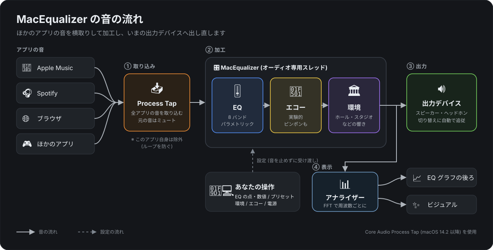

# MacEqualizer

Apple Music・Spotify・ブラウザなど、**Mac 全体の音**に EQ・エコー・ホールなどの響きをかける macOS アプリです。
画面は Logic Pro の Channel EQ を参考にしています。

## 音の流れ

1. **取り込み** 📥 — macOS の Process Tap で、このアプリ以外のすべてのアプリの音を取り込む。元の音はミュートされる
2. **加工** 🎛️ — EQ → エコー → 環境 (響き) の順にかける。オーディオ専用のスレッドで動き、画面の操作では途切れない
3. **出力** 🔊 — いまの出力デバイス (スピーカー・ヘッドホン・オーディオインターフェース) へ出す。切り替えると自動で追従
4. **表示** 📊 — 出力した音を FFT で分析し、EQ のグラフの後ろ (アナライザー) とビジュアル表示に使う

操作方法や各機能の説明は [discription.md](discription.md) にまとめています。
アプリの中でも、ヘッダー右端の 📖 ボタン、またはメニューバーの「ヘルプ > MacEqualizer の説明」(⌘?) で同じ説明を読めます。

## 機能

- 🎛️ **EQ**: 8 バンドのパラメトリック EQ (ローカット / ローシェルフ / ピーク ×4 / ハイシェルフ / ハイカット)
  - 周波数 20 Hz〜20 kHz、ゲイン ±24 dB、Q 0.1〜12、カットのスロープ 6〜48 dB/Oct
  - グラフの点をドラッグして周波数 (横) とゲイン (縦)、下の数値欄は上下ドラッグで調整
  - プリセット 11 種、電源ボタンで元の音と聴き比べ、出力ゲイン
- 📊 **アナライザー**: 加工後の音のスペクトルをグラフの後ろにリアルタイム表示
- 🏛️ **環境**: スタジオ / ライブハウス / コンサートホール / 大ホール / アリーナ / 大聖堂 の響き。量は % で調整
- 🔁 **エコー** (実験的): 間隔・繰り返し・量・ピンポン (左右交互)。繰り返すほどこもり、間隔を変えるとテープエコーのように音程が揺れる
- ✨ **ビジュアル**: 音に合わせて粒子が動く表示。上が低音・下が高音で、低音の拍で脈打って火花が飛ぶ
- 出力デバイスの切り替えに自動で追従。設定は自動保存
- アプリを起動している間だけ効き、ウィンドウを閉じるとアプリが終了して元の音に戻る

## 動作環境

- macOS 14.2 以降 (Core Audio の Process Tap を使うため)
- Xcode 16 以降

## ビルド方法

1. `MacEqualizer.xcodeproj` を Xcode で開く
2. ターゲットに `My Mac` を選び、`⌘R` で実行
3. 初回は「システムオーディオ録音」の許可を求められるので **許可** する

署名は「Sign to Run Locally」設定なので、Apple Developer アカウントなしでローカル実行できます。
ビルドし直した直後の初回起動は、macOS の検査で数秒かかることがあります。

アナライザーが動かないときは、*システム設定 > プライバシーとセキュリティ > 画面収録とシステムオーディオ録音* で MacEqualizer を許可してください
(アプリの説明の「困ったとき」に設定を開くボタンがあります)。
動作ログは Console.app で `com.example.MacEqualizer` を検索すると見られます。

## ファイル構成

| ファイル | 役割 |
| --- | --- |
| `MacEqualizer/MacEqualizerApp.swift` | エントリーポイント。メイン画面と説明ウィンドウ (ウィンドウを閉じたら終了) |
| `MacEqualizer/EqualizerModel.swift` | 設定の保持・保存と、Mac 全体の EQ の開始 |
| `MacEqualizer/SystemAudioTap.swift` | Process Tap と集約デバイスの管理 |
| `MacEqualizer/BiquadEQ.swift` | オーディオスレッドで動く処理 (EQ → エコー → 環境)。出力をアナライザー用のリングバッファにも書く |
| `MacEqualizer/EQBand.swift` | バンドの設定と、双二次フィルタの係数計算 (RBJ Audio EQ Cookbook / バターワース) |
| `MacEqualizer/EQPreset.swift` | EQ のプリセット |
| `MacEqualizer/Echo.swift` | エコー (自前のディレイ) とその設定・プリセット |
| `MacEqualizer/RoomReverb.swift` | 環境 (Apple の AUMatrixReverb) と空間のプリセット |
| `MacEqualizer/SpectrumAnalyzer.swift` | 出力を FFT して周波数ごとのレベルと、拍の検出用の帯域ごとの音量を作る |
| `MacEqualizer/ContentView.swift` | 画面全体とヘッダー |
| `MacEqualizer/EQGraphView.swift` | グラフ (目盛り・アナライザー・特性カーブ・操作点) |
| `MacEqualizer/BandControls.swift` | バンドのオン/オフボタンと数値欄 |
| `MacEqualizer/EchoPanel.swift` | エコーの設定パネル |
| `MacEqualizer/ParticleVisualizer.swift` | ビジュアル表示 (粒子の動きと描画、拍の検出) |
| `MacEqualizer/FeatureGuide.swift` | 機能の説明の文章 (アプリの説明画面と discription.md の元) |
| `MacEqualizer/GuideView.swift` | アプリの説明画面と、音の流れの図 |
| `MacEqualizer/Theme.swift` | 配色 |
| `docs/signal-flow.svg` | 上の「音の流れ」の図 |
| `discription.md` | 機能の説明 (アプリの説明画面と同じ内容) |

## 仕組みの詳細

- タップは「自分以外の全プロセス」の音をステレオで取り込みます。自分を除外しないと、加工後に出した音を再び取り込んでループします
- タップは `mutedWhenTapped` なので、元の音はミュートされ加工後の音だけが聞こえます
- タップと集約デバイスは private なので、アプリが落ちても OS が片付けて元の音に戻ります
- 出力デバイスにマイク入力がある場合 (オーディオインターフェースや AirPods など)、その入力ストリームは使わないよう HAL に伝えています
- 加工はオーディオスレッドで動きます。設定はメインスレッドで係数などに直し、オーディオスレッドは `trylock` で取り込むだけなので待ちが発生しません
- アナライザーは 8192 点の FFT (Hann 窓) を 30 fps で計算し、表示点ごとに 1/12 オクターブ幅のパワーを合計しています。
  フルスケールの正弦波が 0 dB、ピンクノイズがほぼ平らに表示されます
- 環境は Apple の AUMatrixReverb をオーディオスレッドから直接呼んでいます。自前で残響を作らないのは、実績のある実装の方が音質が確かなため。
  プリセットは名前ではなく、インパルス応答から実測した残響時間 (RT60) が実際の空間に近いものを割り当てています

  | 環境 | AUMatrixReverb のプリセット | RT60 (実測) |
  | --- | --- | --- |
  | スタジオ | Small Room | 0.29 秒 |
  | ライブハウス | Large Room 2 | 0.95 秒 |
  | コンサートホール | Medium Hall 3 | 1.77 秒 |
  | 大ホール | Large Hall | 2.63 秒 |
  | アリーナ | Large Hall 2 (最初の反射が 42 ms と遅い) | 2.76 秒 |
  | 大聖堂 | Cathedral | 7.64 秒 |

  量は等パワーで混ぜます (量 25% で原音 ×0.87、響き ×0.5)。原音は遅れません
- エコーは自前のディレイです。残響と違い「いつ・どれだけの大きさで繰り返すか」を測れば正しさを確かめられるので自作にしました。
  環境の前に置くので、エコーにも空間の響きがかかります。遅延時間の変化は 1 サンプルあたり最大 0.5 サンプル (音程 0.5〜1.5 倍) に抑えています
- ビジュアル表示の拍は、150 Hz 以下の直近 21 ms の音量が、直近 0.4 秒ほどの平均より 4 dB 以上急に上がったときとしています

## 既知の制限

- **MacEqualizer は 1 つしか同時に動かせません。** 2 つ動かすと互いの出力を取り込み合って発振するため、後から起動した方は開始しません
- 同じ Process Tap 方式のほかの EQ アプリと同時に使うと、同じ理由で発振するおそれがあります
- AirPods などの Bluetooth ヘッドホンでは未検証です
- ビジュアル表示中は CPU を 1 コアの 20〜25% ほど使います (Release ビルド、粒子 540 個を 60 fps で描画)。EQ 表示に戻すと止まります
- 環境をオフからオンに戻した直後、前の響きがごく小さく (約 -23 dB) 残ることがあります (AU のリセットで消えきらない部分)
- エコーは原音に足すので、量や繰り返しを大きくすると音量が上がり、音割れしやすくなります (出力ゲインで下げる)
- 出力デバイスの切り替え時に、一瞬 (数十ミリ秒) 音が途切れます
